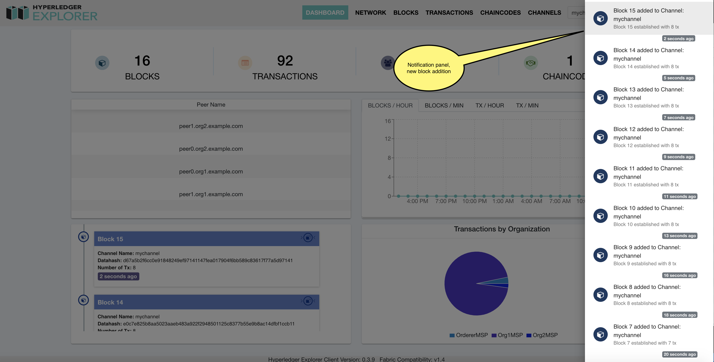

.. SPDX-License-Identifier: Apache-2.0

WebSockets
===========================================

Websocket API is used to push information from the server to the clients. Information about new blocks, stats.
are pushed via Websocket API. This is a convenient API that reduces load on clients and server.

The image below illustrates how the notification is displayed when new blocks are received from the blockchain network, and a link to the
new block details is provided in the notification panel.

.. TODO
