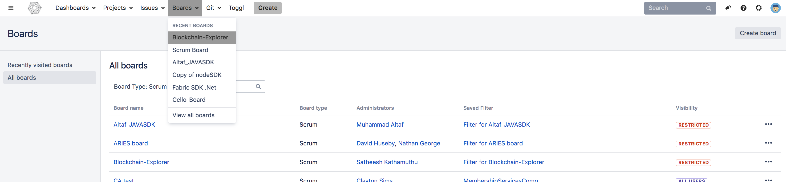
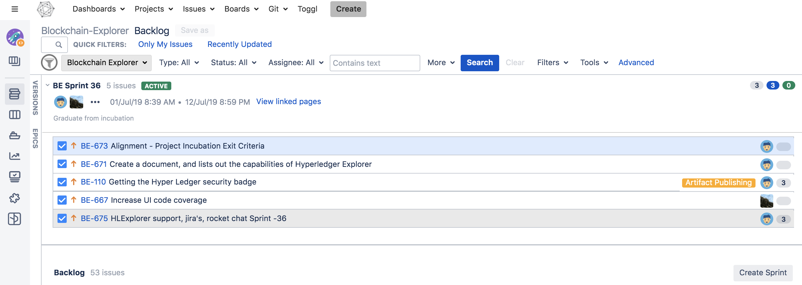

Using Jira to understand current work items
===========================================

This document has been created to give further insight into the work in
progress towards the Hyperledger Explorer on the
community roadmap.

It was determined to organize in sprints to better track and show a
prioritized order of items to be implemented based on feedback received.
We’ve done this via boards. To see these boards and the priorities click
on **Boards** -> **Manage Boards**:

   Jira boards

The meanings to these columns are as follows:

-  Backlog – list of items slated for the current sprint (sprints are
   defined in 2 week iterations), but are not currently in progress
-  In progress – items currently being worked by someone in the
   community.
-  In Review – items waiting to be reviewed and merged in Gerrit
-  Done – items merged and complete in the sprint.

If you want to see all items in the backlog for a given feature set,
click on the stacked rows on the left navigation of the screen:

   Jira boards

This shows you items slated for the current sprint at the top, and all
items in the backlog at the bottom. Items are listed in priority order.

If there is an item you are interested in working on, want more
information or have questions, or if there is an item that you feel
needs to be in higher priority, please add comments directly to the Jira
item. All feedback and help is very much appreciated.

.. Licensed under Creative Commons Attribution 4.0 International License
   https://creativecommons.org/licenses/by/4.0/
