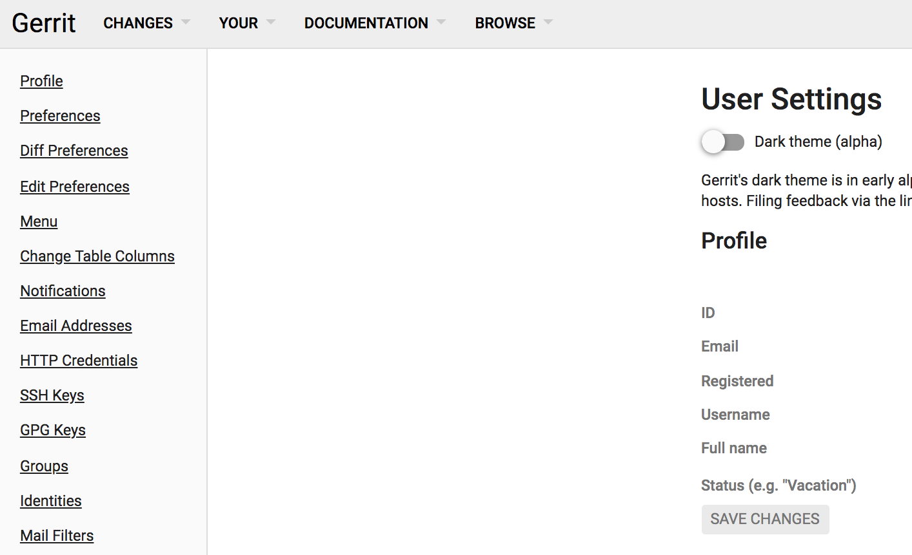
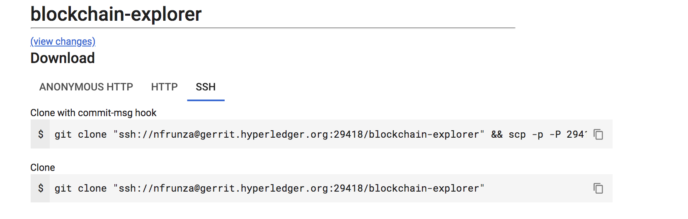

:orphan:

Submitting your first change request (CR)
-----------------------------------------

We are using
`Gerrit <https://gerrit.hyperledger.org/r/admin/repos/blockchain-explorer>`__ to
manage code contributions and reviews. If you are unfamiliar with Gerrit,
please review this :doc:`document <Gerrit/gerrit>` before proceeding.

Setting up your SSH key
~~~~~~~~~~~~~~~~~~~~~~~

Before you can submit a change set for review, you will need to register your
public SSH key. Login to
`Gerrit <https://gerrit.hyperledger.org>`__ with your
:doc:`LFID <Gerrit/lf-account>`, and click on your name in the upper

right-hand corner of your browser window and then click 'Settings'.

In the left-hand margin, you should see a link for 'SSHKeys'.

Copy-n-paste your `public SSH key <https://help.github.com/articles/generating-an-ssh-key>`__ into
the field ``New SSH key...`` and press `SAVE CHANGES` button.

.. image:: images/AddSSH1.png
    :width: 850px

Clone your project
~~~~~~~~~~~~~~~~~~

First step is to clone your project to your laptop or development server.
Navigate your browser to the Gerrit `Projects <https://gerrit.hyperledger.org/r/#/admin/projects>`__
page and scroll down to the ``blockchain-explorer`` project.

The project page will provide you with the full git clone command needed to
clone the project. Select the ``clone with commit-msg hook`` option and copy the
command to the clipboard.

Now, in a terminal window on your laptop, paste and run the command. e.g.

.. code::

   git clone "ssh://<LFID>@gerrit.hyperledger.org:29418/blockchain-explorer" && scp -p -P 29418 <LFID>@gerrit.hyperledger.org:hooks/commit-msg "blockchain-explorer/.git/hooks/"

Checkout a development branch
~~~~~~~~~~~~~~~~~~~~~~~~~~~~~

Now that you have cloned the repository, change directory to the ``lf-sandbox``
directory. Now let's make a change. First, let's create a new branch in which
to work:

.. code::

   git checkout -b <newbranchname>

Now let's modify a file. Pick a file, any file and make a change. You can also
add a new file or delete an existing file. Don't be shy, this is just a
sandbox.

Committing your change
~~~~~~~~~~~~~~~~~~~~~~

Once you've made your change, check to see what the current status is.

.. code::

   git status
   On branch foo
   Untracked files:
    (use "git add <file>..." to include in what will be committed)

	 README.md

   nothing added to commit but untracked files present (use "git add" to track)

Now let's add the changed file to the list of files tracked by git.

.. code::

   git add .

Now let's commit that change.

.. code::

   git commit -signoff

This will open up an editing session using your favorite command-line editor
where you will fill in a commit message. Add a commit message.

.. note:: Note that for the Hyperledger Explorer we would have a
          title line that includes the JIRA number of the issue to which the
          change request applies.

.. code::

   BE-1234

   I made a change

   Signed-off-by: John Doe <john.doe@example.com>

   # Please enter the commit message for your changes. Lines starting
   # with '#' will be ignored, and an empty message aborts the commit.
   # On branch foo
   # Changes to be committed:
   #       new file:   README.md
   #

Submitting your change request
~~~~~~~~~~~~~~~~~~~~~~~~~~~~~~

Once you have saved the commit message, you can push the change request
to Gerrit. Here, we have a couple of options.

The first option is to use the full git syntax.

.. code::

   git push ssh://<LFID>@gerrit.hyperledger.org:29418/blockchain-explorer HEAD:refs/for/<branch name>

.. note:: You need to change ``<LFID>`` to you Linux Foundation ID, and ``<branch name>`` to the branch name you are working on.

This will yield results something like the following:

.. code::

   Counting objects: 3, done.
   Delta compression using up to 4 threads.
   Compressing objects: 100% (2/2), done.
   Writing objects: 100% (3/3), 340 bytes | 0 bytes/s, done.
   Total 3 (delta 1), reused 0 (delta 0)
   remote: Resolving deltas: 100% (1/1)
   remote: Processing changes: new: 1, refs: 1, done
   remote: Missing issue-id in commit message
   remote: Commit 539d9a1fe036f332db87d37b49cea705bdf6e432 not associated to any issue
   remote:
   remote: Hint: insert one or more issue-id anywhere in the commit message.
   remote:       Issue-ids are strings matching ([A-Z][A-Z0-9]{1,9}-\d+)
   remote:       and are pointing to existing tickets on its-jira Issue-Tracker
   remote:
   remote: New Changes:
   remote:   https://gerrit.hyperledger.org/r/16157 I made a change
   remote:
   To ssh://gerrit.hyperledger.org:29418/lf-sandbox
    * [new branch]      HEAD -> refs/for/master

Check that your change request is validated by the CI process
~~~~~~~~~~~~~~~~~~~~~~~~~~~~~~~~~~~~~~~~~~~~~~~~~~~~~~~~~~~~~

To ensure stability of the code and limit possible regressions, we use
a Continuous Integration (CI) process based on `Jenkins <https://jenkins.hyperledger.org/view/blockchain-explorer/>`__ which triggers
a build on several platforms and runs tests against every change
request being submitted. It is your responsibility to check that your
CR passes these tests. No CR will ever be merged if it fails the
tests and you shouldn't expect anybody to pay attention to your CRs
until they pass the CI tests.

To check on the status of the CI process, simply look at your CR on
Gerrit, following the URL that was given to you as the result of the
push in the previous step. The History section at the bottom of the
page will display a set of actions taken by "Hyperledger Jobbuilder"
corresponding to the CI process being executed.

Upon completion, "Hyperledger Jobbuilder" will add to the CR a *+1
vote* if successful and a *-1 vote* otherwise.

In case of failure, explore the logs linked from the CR History. If
you spot a problem with your CR and want to modify it, proceed to the
following section.

Modifying your change request
~~~~~~~~~~~~~~~~~~~~~~~~~~~~~

If you need to update your patch, say to address a review comment, or to fix
something affecting CI, you can commit revised changes with

.. code::

   git commit --amend

and then repeat the ``git review`` or full syntax as before. Then
check the results of the CI process that gets triggered as a result.

Should you have further questions, please don't hesitate to ask on the mailing
list or rocket chat.

.. Licensed under Creative Commons Attribution 4.0 International License
   https://creativecommons.org/licenses/by/4.0/
